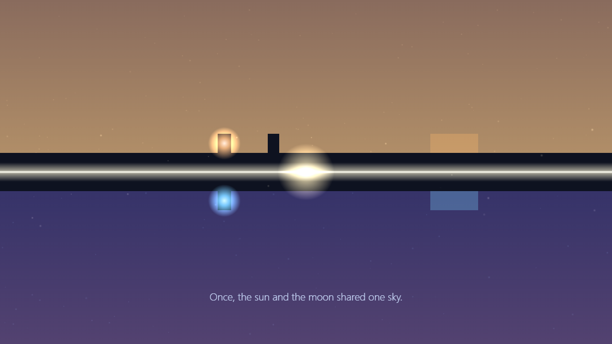
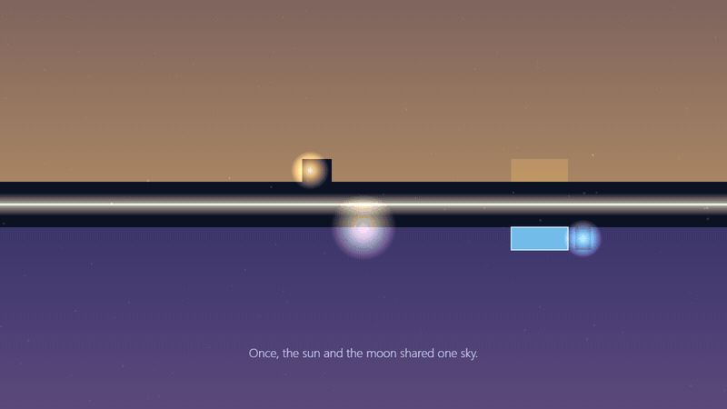
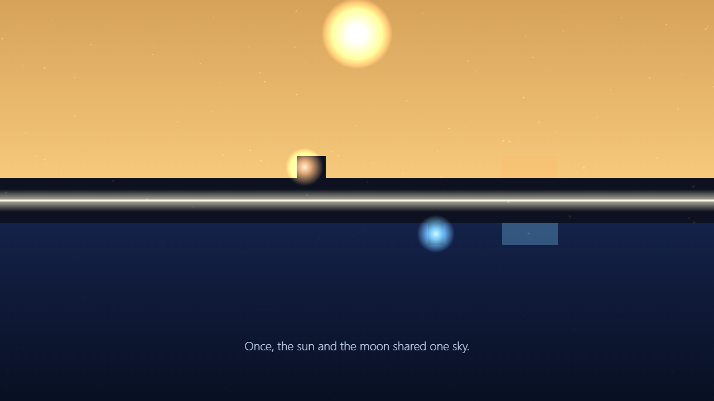
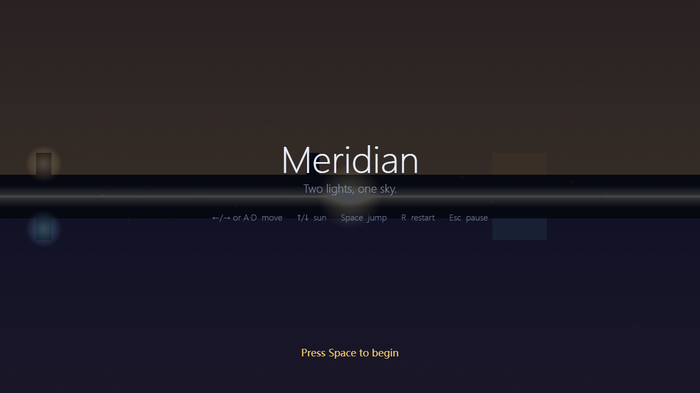

# Meridian

**Two lights, one sky.**

A browser puzzle-platformer about two mirrored worlds — a warm day above and a
cool night below — that share a single sun at the solstice. Move both halves at
once, raise and lower the sun to reshape each world, and decide how much of your
light you are willing to spend to cross.

**▶ Play in your browser: https://aierkuite.github.io/meridian/**



### Watch it move



## The idea

At the longest day, the sun and the moon were pulled apart, and the world split
into two mirrored halves that still move as one.

- **Two worlds, one body.** A warm **day** world sits above; a cool **night**
  world sits below. They meet at a glowing horizon — the *meridian*. You guide
  both avatars, **Sol** (above) and **Luna** (below), with a single set of
  controls: left and right are identical, but up and down are mirrored, because
  each world's gravity points the opposite way.
- **Hold the sun.** One shared sun spans both worlds, and raising or lowering it
  has **opposite effects** top and bottom — warm the day and you cool the night,
  brighten one and you darken the other.
- **Light reshapes the world.** The sun transforms paired elements on each side:
  day ice melts to water while night ice hardens into a bridge, day vines climb
  while night fungi bloom, light-doors and dark-gates open and close, and a
  balance mote is solid only when the sun is held *just so*. A path for one world
  is rarely a path for both at the same moment — timing the sun is the puzzle.
- **Light has a cost.** At a few crossings there is a faster way that **spends a
  piece of your light**. What you spend — and whether you keep the two halves in
  balance — is remembered.
- **An earned ending.** Those choices accumulate into one of **four distinct
  endings**, ranging from a luminous reunion to a long, quiet dark. The finale is
  a single mechanical coming-together: there is **no last-second menu**, only the
  ending you earned along the way.



## Controls

Meridian is keyboard-only, and the same input moves both worlds at once.

| Action | Keys |
|--------|------|
| Move | `←` / `→` or `A` / `D` |
| Raise / lower the sun | `↑` / `↓` |
| Jump | `Space` |
| Restart the current beat | `R` |
| Pause | `Esc` |

On the title screen, press **`Space`** to begin.



## Run it locally

The game lives in the `meridian/` folder. You'll need [Node.js](https://nodejs.org/) 20 or newer.

```bash
cd meridian
npm install
npm run dev
```

Vite prints a local URL (usually http://localhost:5173) — open it and press `Space`.

Build a production bundle:

```bash
cd meridian
npm run build
```

> **Windows note:** if PowerShell blocks `npm.ps1`, use `npm.cmd` instead
> (for example `npm.cmd install`, `npm.cmd run dev`).

## Quality checks

Meridian's simulation is deterministic, and every puzzle ships with recorded
solution paths, so "is the game still beatable?" is an assertion the project can
run rather than a hope. From `meridian/`:

```bash
npm run typecheck         # strict TypeScript, no emit
npm run check:determinism # the fixed-timestep simulation is reproducible
npm run check:replay      # every segment is solvable; all four endings are reachable
npm run build             # type-check + production bundle
```

## Music & audio

Meridian's audio is fully procedural and self-contained, so the repo stays
clone-and-play with **no binary music asset committed**:

- **Default ambient bed** — a layered Web Audio oscillator pad generated at
  runtime (`meridian/src/audio/audio.ts`). It is original to this project and
  redistributable.
- **Sun-driven filter** — the bed (and any local track) routes through a
  sun-tracked low-pass + reverb: a low sun is muffled and dark, a high sun is
  open and bright.
- **Procedural SFX** — jump, sun motion, element changes, light-cost choices,
  the finale fusion, and each ending are all synthesized; there are no SFX files.
- **Optional local track** — drop a file at `meridian/public/music/local.mp3`
  (also `.ogg`, `.m4a`, or `.wav`). It is git-ignored, private, and
  hot-swappable: when present it loops through the same sun filter and the
  default bed fades out; if it is missing or fails to load, the procedural bed
  simply plays. A local track is never committed.
- Audio unlocks on the first key press, because browsers block sound until a
  user gesture.

## Under the hood

- **TypeScript + vanilla Canvas 2D + Vite**, with no game framework.
- A deterministic, render-free **simulation** (movement, sun, puzzle elements,
  consequence, endings) is kept strictly separate from **presentation** (canvas
  rendering, Web Audio, HUD). Presentation only ever *reads* simulation state,
  which is what makes the replay/solvability checks possible.
- Procedural visuals: clean silhouettes with a glowing core over a sun-driven sky
  gradient, plus pooled atmospheric particles.

## Credits & license

Made by **aierkuite**.

- **Code** is released under the [MIT License](LICENSE).
- **Audio** — the default ambient bed and every sound effect — is procedurally
  generated and original to this project; it is redistributable, and no
  third-party audio is bundled.
- **Images** under `docs/media/` are original screen captures of this game; no
  stock or third-party art is used.
